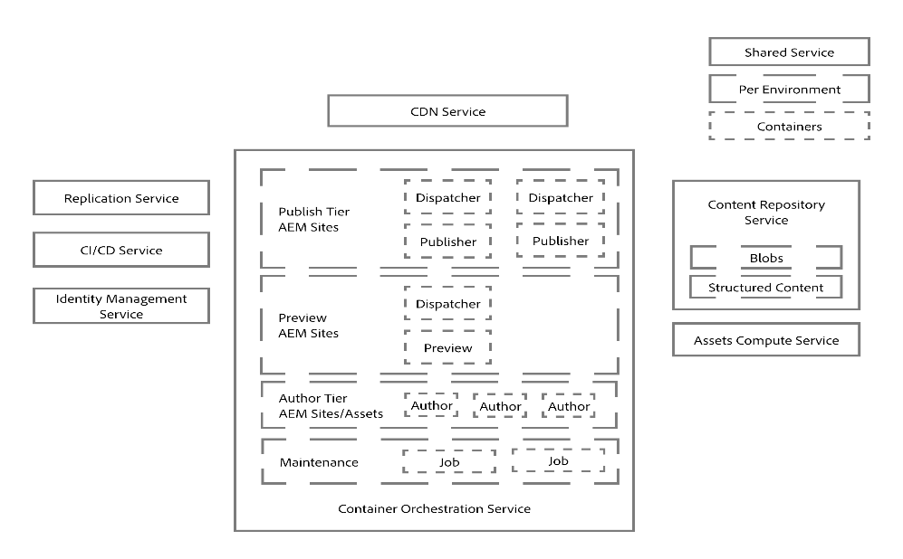
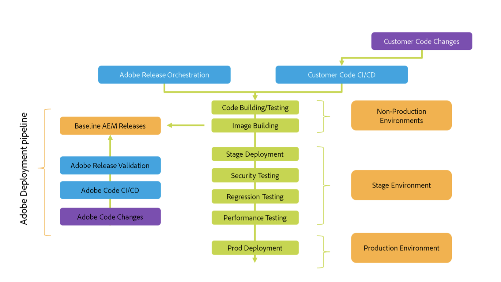

## AEM On-Premises Architecture

AEM on-premises architecture is a traditional deployment model where the AEM instances are hosted within an organization’s own data center or on their private cloud. This model gives organizations complete control over their infrastructure, security, and compliance.

- Key Components of AEM On-Premises Architecture
    - Author Instance
    - Publish Instance
    - Dispatcher
    - Database
    - File System
    - Replication Agents
    - Backup and Recovery

### Detailed Explanation of Components

#### Author Instance

- Purpose.
    - The Author instance is where content creators, editors, and marketers work. It is used for creating, editing, and managing the content.

- Features.
    - Content creation and editing
    - Workflow and approvals
    - Versioning and content management
    - User and group management
    - Integrated tools for digital asset management

#### Publish Instance
- Purpose
    - The Publish instance is responsible for delivering the content to end users. It serves the content through websites, mobile apps, and other channels.
- Features
    - High-performance content delivery
    - Scalability to handle large volumes of traffic
    - Secure delivery of published content
    - Integration with CDNs for global reach
#### Dispatcher
- Purpose
    - Dispatcher is a caching and load-balancing tool used to increase the performance of AEM. It caches content to reduce the load on the publish instances and balances the load among multiple publish instances.
- Features
    - Caching of HTML, images, and other static content
    - Load balancing across multiple publish instances
    - URL filtering and security enhancements
#### Database
- Purpose
    - The database is used to store content metadata, user data, and configuration settings. AEM supports various database systems such as PostgreSQL, MySQL, Oracle, and others.
- Features
    - Storing content metadata and configuration
    - Ensuring data integrity and consistency
    - Supporting transactional operations and queries
#### File System
- Purpose
    - The file system is used to store binary content such as images, videos, and other digital assets. These files are usually stored in a shared storage system accessible by AEM instances.
- Features
    - High-performance storage for large files
    - Support for distributed and shared file systems
    - Integration with AEM for asset management
```aem
+-------------------+
|    File System    |
|                   |
| +---------------+ |
| |   Binaries    | |
| |   Storage     | |
| +---------------+ |
+-------------------+
```

#### Replication Agents
- Purpose
    - Replication agents are responsible for transferring content from the author instance to the publish instances. They ensure that the latest content is available for end users.
- Features
    - Reliable and secure content transfer
    - Support for scheduled and on-demand replication
    - Monitoring and logging of replication activities

#### Backup and Recovery
- Purpose
    - Ensures that content, configurations, and system states can be restored in case of data loss, corruption, or system failures.
- Features
    - Regular backups of databases and file systems
    - Automated backup schedules and policies
    - Disaster recovery planning and implementation
```js
+-------------------+     +-------------------+     +-------------------+
|   Author Server   |     |   Dispatcher      |     |   Publish Server  |
|                   |     |                   |     |                   |
| +---------------+ |     | +---------------+ |     | +---------------+ |
| |    Author     | |<--> | |    Cache      | |<--> | |    Publish    | |
| |    Instance   | |     | +---------------+ |     | |    Instance   | |
| +---------------+ |     +-------------------+     | +---------------+ |
|                   |          ^     ^              |                   |
| +---------------+ |          |     |              | +---------------+ |
| |   Database    | |          |     |              | |  Database     | |
| +---------------+ |          |     |              | +---------------+ |
|                   |          |     |              |                   |
| +---------------+ |          |     |              | +---------------+ |
| | File System   | |          |     |              | | File System   | |
| +---------------+ |          |     |              | +---------------+ |
+-------------------+          |     |              +-------------------+
         |                    Replication                    |
         +---------------------------------------------------+

```

- Control: Complete control over the infrastructure, security, and compliance.
- Customization: High flexibility for customization and integration with existing systems.
- Security: Direct control over security policies and data protection measures.

- Challenges:

    - Cost: Higher upfront and ongoing costs for hardware, maintenance, and staffing.
    - Complexity: Requires skilled IT staff to manage and maintain the infrastructure.
    - Scalability: Scaling resources can be more complex and slower compared to cloud solutions.
    
AEM on-premises architecture is suitable for organizations with stringent compliance, control, and customization requirements, providing full control over the entire content management infrastructure.


## AME on Managed Services Architecture

AEM is hosted on Adobe’s cloud infrastructure but managed by Adobe.
- Components
    - Author Instance: Managed by Adobe.
    - Publish Instance: Managed by Adobe.
    - Dispatcher: Managed by Adobe.
    - Cloud Manager: For deployment, monitoring, and scaling.


```js
+--------------------+
|  Adobe Managed     |
|     Services       |
+--------------------+
         |
         v
+--------------------+
|   Cloud Manager    |
+--------------------+
         |
         v
+---------+----------+
|         |          |
|   Author Instance  |
|   Publish Instance |
+--------------------+
         |
         v
+--------------------+
|    Dispatcher      |
+--------------------+
         |
         v
+--------------------+
|   End Users        |
+--------------------+
```
- Ideal for organizations looking to offload infrastructure management to Adobe while maintaining some control.
- Offers a balance between control and managed services.


## AEM as a Cloud Service (AEMaaCS) – Architecture Overview

Adobe Experience Manager (AEM) is one of the leading CMS from Adobe and is part of Adobe Experience Cloud (AEC). The Adobe Experience Manager (AEM) web content management offers a set of capabilities for creating, managing, delivering, and personalizing content across various digital marketing channels, including web, mobile, and email. 

Before we dive into architecture of AEM as a Cloud Service (AEMaaCS) we need to understand 
- why AEMaaCS is needed and how it is different as compared to classic AEM. 

    - Challenges with traditional/classic AEM (the AEM that majority of us have used from last 10-12 years)

### Challenges with classic AEM

Let’s quickly look at the components of classic AEM application to understand the challenges with old AEM.


AEM is combination of many frameworks (Felix, OSGi, JCR/Oka repository and many other OSGi modules). Important thing to note is, all these modules are running on single JVM. This is a big limitation in terms of performance and scalability of AEM. Apart JVM, traditional AEM also suffered from issues related to JCR repository, asset ingestion, replication related and other issues.

- Here are some key challenges with traditional AEM:

    - A typical classic/old AEM instances (author or publish) runs on single JVM instances along with all OSGi modules and supporting components
    - Oka/JCR repository related limitation adds to scalability issues (slow I/O operation under load, number of parent/child nodes, performance degrade because concurrent user access)
    - Computational limitations (e.g., asset processing and rendition generation)
    - Content replication related issues (performance, reliability etc.)

At high level these issues are very common and exists with any traditional monolithic applications. Because of these issues and current architecture AEM was not cloud ready/native and was not capable of scaling dynamically. Where there are challenges there are needs. So, the need was to make AEM cloud-native and hence AEMaaCS came in to picture.

## AEM as a Cloud Service Architecture

Adobe have come up with an innovative cloud-native solution for Adobe Experience Manager (AEM) to solve various challenges involved in scalability, maintenance, content delivery, assets handling & release of new features.

- AEM as Cloud Service is

    - Always On– Service architecture has been revised so that there is no downtime for neither content management nor the content delivery capabilities.
    - Always at Scale– Service architecture will automatically scale up and down depending on needs.
    - Always Current– It implements a continuous delivery pipeline for the AEM codebase, with automated updates several times a month keeps the AEM application up-to date with recent versions.
    - Always Evolving– Based on the projects implemented content, code & configurations are constantly reviewed against best practices allowing clients to achieve business goals.
 

In AEM On-Premises solution the biggest challenge is to setup production environment with author & publish instances by considering various parameters such as traffic, concurrent users, asset handling etc. but in AEM as Cloud Service with new architecture solves this major problem.

- This architecture

    - Is scaled based on the actual traffic & user activity.
    - Has individual instances that only run when needed.
    - Uses modular applications.
    - Has an author cluster as default, this avoids downtime for maintenance tasks.

### Scaling

- Both author & publish instances are scalable.

    - Vertical – allocated memory and CPU capacity can be scaled up or down for a fixed number of nodes.
    - Horizontal – the number of nodes for a given service can be increased or decreased.
 

### Environments

T- here are three types of environments available with AEM as Cloud Service.

    - Production environment – hosts the application for the business practitioners.
    - Stage environment – Is always coupled with production in a 1:1 relationship (Both environments uses same CI/CD pipeline for deployment, where production requires approval). The stage environment is used for various performance & quality testing.
    - Development environment – allows developers to implement AEM applications.

### Programs

- AEM as Cloud Service offers two types of programs both allows number of features & functionalities.

    - AEM Cloud Site Service
    - AEM Cloud Assets Service
- Each program will have
    - 1 Adobe managed code repository (Git)
    - 1 Stage + Production environment
    - N Development environments
    - 1 Deployment & 1 Code Quality Pipeline for Each Environment
 

### Cloud Manager

Cloud Manager is a User Interface (UI), a part of Adobe Managed Cloud Services enables organization to self-manage Experience Manager in the cloud.

- Key features of Cloud Manager are

    - Continuous Integration/Continuous Deployment
    - Code Inspection, Performance Testing & Security Validations
    - Automatic (On Git Changes), Manual & Scheduled Deployment
    - Auto Scaling
    - Configure Programs & Environments
    - Configure SSL Certificates, Domain Settings, IP Allow Lists

### Architecture

Runtime architecture of AEM as Cloud Service is divided into various main components which are explained as below.



- Author Tier

    - Author Tier is made up of single author cluster with 2 or more nodes. It scales automatically depending on authoring activity.
    - Content authors login to AEM Author to create, edit & manage content.
    - Logging into author tier is managed by Adobe “Identity Management Service”(IMS).
    - “AEM Cloud Assets Service” is enabled in AEM Author. Assets integration & processing uses a dedicated Assets Compute Service.
- Publish Tier

    - Publish Tier consist of 2 or more nodes with single publish farm: they can operate independently from each other.
    - Each node consists of a AEM Publish & a web server equipped with the AEM Dispatcher module. It scales automatically with site traffic needs.
    - End users or site visitors visit the website via the AEM Publish Service.
    - AEM Cloud Assets Service is disabled by default.
    - For publish tier, a Content Delivery Network (CDN) Service is also available at the first entry point.
- Preview Service

    - Preview Service feature delivers an additional Preview Service to each AEM as Cloud Service environment via Cloud Manager.
    - It allows to Preview website’s final experience before it reaches Publish Tier & is available publicly.
- Common

    - Both Author & Publish Tiers reads & persists content from/to a Content Repository Service.
    - The Publish Tier only reads content from persistence layer.
    - The Author Tier reads & writes content from and to the persistence layer.
    - The blob storage is shared across the Publish & Author Tiers, files are not moved.
    - Access to Author & Publish Tiers always happens via a load balancer. This is up to date with active node of each of the tier.
- Replication Service

    - When content is approved from Author Tier by activation it will be pushed to the Publish Tier persistence layer. This happens via “Replication Service” a middle-ware pipeline.
    - This pipeline receives the new content, with individual publish service subscribing to the content pushed to the pipeline. For more information on replication mechanism & setup go through below links.
    - Replication Service uses “Sling Content Distribution” to move content from Author Tier to Publish Tier [Replication Agents are no more supported in AEM as Cloud Service].
- CI/CD Service

    - Cloud Manager manages all updates to AEM as Cloud Service.
    - Updates are triggered when
        - A new version of AEM Cloud Service is ready from Adobe.
        - A new version of Customer Application is ready.
    - Cloud Manager pipeline combines new version of Customer Application + Baseline Adobe Image. When Images are built & tested successfully, Cloud Manager automates the cut-over to latest version of the image by updating all the nodes using rolling update pattern.

- Here is a quick summary of the external services with which AEM Cloud Service integrates:

    - CDN Service – a CDN (Fastly) comes OOTB – previously customers had to provide their own CDN.

    - Replication Service – legacy replication has been replaced with content distribution.
    
    - CI/CD Service – this is essentially Cloud Manager, which is not new but has several enhancements that are specific to AEM Cloud Service.
    
    - Identity Management Service – this is the integration with Adobe IMS.
    
    - Content Repository Service – this is how the instances access the content.  

    - Assets Compute Service – we’ll talk about that in more details.
    
    - Testing Service – this is leveraged by Cloud Manager to run a suite of different tests during deployment. 
    
    - Orchestration Service – this is what monitors the load on each tier and auto-scales the instances.  It can scale horizontally (by adding instances) or vertically (by adding memory and/or CPU capacity).




- Identity Management Service

    - AEM as a Cloud Service includes Admin Console support for AEM instances and   - Adobe Identity Management System (IMS) based authentication.
    - The Admin Console allows admins to centrally manage all Experience Cloud users.
    - Users and Groups can be assigned to product profiles associated with AEM as a Cloud Service instances, allowing them to log in to that instance.
- CDN Service
    - AEM as Cloud Service comes with built-in CDN called “Fastly”.
    - Its main purpose is to reduce latency by delivering cacheable content from the CDN nodes at the edge.
    - It is fully managed and configured for optimal performance of AEM applications.
    - Custom Managed CDN are also supported in AEM as Cloud Service. However, Custom CDN must point to AEM Managed CDN (i.e. Fastly).
 

### Comparison

| Feature|   On-Premises Architecture | Managed Services Architecture | AEM as a Cloud Service (AEMaaCS) | 
| ----- | :------------------: | :------------------: | :------------------: | 
| Control | Complete control over infrastructure | Partial control, managed by Adobe | Limited control, fully managed by Adobe |
| Customization | High |Moderate | Limited |
| Operational Complexity | High | Reduced | Minimal |
| Scalability | Challenging | High | Very High |
| Cost | High upfront and ongoing costs | Potentially higher ongoing costs | Subscription-based, potentially cost-efficient |
| Maintenance and Updates | Managed in-house | Managed by Adobe | Managed by Adobe |
| Deployment Model | On-premises data centers | Adobe cloud infrastructure | Cloud-native infrastructure |
| Security and Compliance | Direct control | High standards managed by Adobe | High standards managed by Adobe |
| Performance | Dependent on internal setup | High | Very high with global CDN |
| Resilience and Availability | Dependent on internal setup | High | Very high with self-healing and automatic scaling |

